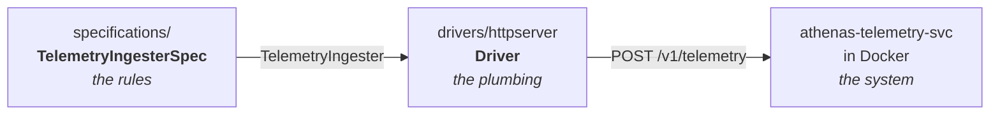

# athenas-telemetry-svc

A distributed telemetry ingestion service in Go, grown milestone by milestone under outside-in TDD.

This is a **self-directed study project** — the curriculum, milestones, and constraints are self-designed, not coursework and not assigned. The goal is to build a horizontally scalable, stateful backend service the way it would be built on a team that takes testing seriously, and to have the design decisions be defensible under review.

> **Status: Milestone 1 of 7 — walking skeleton.** The service accepts and validates telemetry over HTTP and returns `202 Accepted`. It does not yet do anything with the payload; that's Milestone 2. See the [roadmap](#roadmap) for what's built and what isn't.

---

## Why this project

My background is low-level and stateless: embedded C++ servers on millions of Sonos devices, an async I/O library built on socket multiplexing, and AWS Lambda workflows at Epic. Lambda scales effortlessly precisely because it abstracts stateful node concurrency away from you.

This project drops into the engine room that abstraction hides — persistent in-memory buffers, channel-owned state, worker pool coordination, and the delivery guarantees you have to build yourself once more than one process is involved. Each milestone pairs a distributed systems concept with the concurrency primitives underneath it.

The secondary goal is a rigorous testing practice. The whole project is built outside-in, following *Growing Object-Oriented Software, Guided by Tests* — read cover to cover alongside the build rather than cherry-picked.

## Design approach: one specification, many drivers

The most important structural decision in the repo is the seam between **what the system must do** and **how you talk to it**.

`specifications/` holds the executable specification: a table of behavioral cases written against a narrow interface, with no knowledge of HTTP, JSON, or Gin.

```go
// specifications/telemetry_spec.go
type TelemetryIngester interface {
	Ingest(telemetry models.Telemetry) error
}

func TelemetryIngesterSpec(testCtx *testing.T, ingester TelemetryIngester)
```

A **driver** implements that interface against a real deployment. The current one issues live HTTP requests to a containerized instance of the service:



The payoff is that behavior is asserted once and verified everywhere. As later milestones add transports and deployment topologies — an SQS consumer, a multi-pod cluster — each gets a new driver satisfying the same interface, and the same specification runs against all of them unchanged. The specification is also runnable against fast in-process adapters, which keeps the fast test tier meaningful as the container-backed tier gets slower.

New behavior starts in the specification, fails, and only then gets implemented.

## Architecture

Two Go modules, deliberately separated so the acceptance suite can only reach the service the way a real client would:

| Path | Role |
|---|---|
| `athenas-telemetry-svc/` | The service. `cmd/athenas` → `internal/api` (Gin) → `models`, plus the exported `specifications/` package |
| `athenas-acceptance-tests/` | Black-box acceptance suite: drivers, Testcontainers harness, and the tests that wire them to the specification |

Dependencies flow one way — the acceptance module imports the service, never the reverse. The service is resolved through a local `replace` directive so tests always exercise the working tree rather than a published version.

`specifications/` lives in the service module and is intentionally exported rather than `internal/`, so the separate test module can consume it. That placement is what makes the one-spec-many-drivers arrangement possible across a module boundary.

Acceptance tests build `deploy/Dockerfile` through Testcontainers and run against the resulting container, so they exercise the same image that would ship.

## Running it

Tooling is managed with [mise](https://mise.jdx.dev/) — `mise install` provisions the pinned Go toolchain.

```bash
mise run test                                # fast unit tests (default: telemetry-svc)
mise run test acceptance-tests --all         # full acceptance suite (requires Docker)
mise run test telemetry-svc . TestFoo        # a single test by name or regex
mise run test telemetry-svc --race           # with the data race detector
mise run test telemetry-svc --bench --memprofile   # benchmarks, allocations, memory profile
```

The acceptance suite is gated behind `--all` because it builds a Docker image per run; the default invocation keeps the inner loop fast.

## Roadmap

Each milestone pairs theory from the [Educative distributed systems path](https://www.educative.io/path/become-a-distributed-systems-professional) with a corresponding chunk of GOOS, and adds one distributed systems capability to the service.

| # | Milestone | Adds | Status |
|---|---|---|---|
| 1 | Walking Skeleton | HTTP ingest endpoint, validation, containerized E2E harness | 🔨 In progress |
| 2 | In-Memory Concurrency | Channel-based dispatch ring and worker pools; allocation profiling under load | ⬜ Planned |
| 3 | Queue Integration | Buffer flush to AWS SQS, exercised offline against LocalStack | ⬜ Planned |
| 4 | Transactional Outbox | Atomic Postgres write of event + outbox row, with poll-and-publish workers | ⬜ Planned |
| 5 | Event Streaming | Kafka consumer groups with explicit consumer-side backpressure | ⬜ Planned |
| 6 | Distributed Coordination | Multi-pod Kubernetes deployment; Redis-backed global rate limiting | ⬜ Planned |
| 7 | Delivery & Observability | GitHub Actions CI/CD and DORA four-keys instrumentation | ⬜ Planned |

Milestones are sequential by design. Each one is meant to be correct and well-shaped before it is made fast — performance work follows a benchmark, not an intuition.

## Curriculum

- **[Growing Object-Oriented Software, Guided by Tests](https://growing-object-oriented-software.com/)** — Freeman & Pryce. The source of the walking-skeleton approach, the specification/driver split, and the outside-in cycle.
- **[Become a Distributed Systems Professional](https://www.educative.io/path/become-a-distributed-systems-professional)** — Educative. Three courses on distributed systems fundamentals, protocols, and production concerns; this repo is the lab for it.
- **[Learn Go with Tests](https://quii.gitbook.io/learn-go-with-tests)** — Chris James. Go-idiomatic TDD; the direct source of the scaled acceptance test structure used here.
- **[The Practical Test Pyramid](https://martinfowler.com/articles/practical-test-pyramid.html)** — Ham Vocke. The reason the container-backed suite stays deliberately small.

## License

MIT — see [LICENSE](LICENSE).
