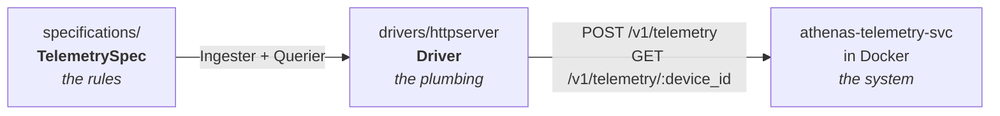

# Why TDD?

- [Why TDD?](#why-tdd)
  - [TDD and the future of agentic engineering](#tdd-and-the-future-of-agentic-engineering)
    - [Agentic engineering can be exhausting](#agentic-engineering-can-be-exhausting)
      - [(1) it's easy to not understand what you're pushing and not have 100% confidence it works](#1-its-easy-to-not-understand-what-youre-pushing-and-not-have-100-confidence-it-works)
      - [(2) tech debt piles up to MONUMENTAL levels](#2-tech-debt-piles-up-to-monumental-levels)
    - [Automated engineering rigor](#automated-engineering-rigor)
  - [How I use specifications](#how-i-use-specifications)

## TDD and the future of agentic engineering

When working on this service, I followed TDD principles influenced by **[GOOS](https://growing-object-oriented-software.com/)** and **[Learn Go with Tests](https://quii.gitbook.io/learn-go-with-tests)**, and not just because I think it checks boxes. 

**I think it's the future of agentic engineering.**

OK, sure, you might be skeptical. **GOOS** is 15+ years old at the time of writing this. Authors Steve Freeman and Nat Pryce certainly didn't have AI in mind when writing about the principles they outlined in **GOOS**.

**So... what problem CAN this book solve with agentic engineering if AI is so smart and the models are just getting better and better?**

Simple: strong software engineering rigor.

It's undoubtedly true that engineering rigor is universally beneficial for human and agent alike, but it's often not followed. Usually because it's deemed too expensive in terms of time or cloud costs (those automated test suite environments don't grow on trees!), or pushed off to the end of a project after everything is shipped.

But in a time where agents can generate thousands of lines of code that were modelled from average quality code bases (which is, you know... probably not great) in minutes, I've encountered a couple of problems:

1. it's easy to not understand what you're pushing and not have 100% confidence it works
2. tech debt piles up to MONUMENTAL levels

### Agentic engineering can be exhausting

#### (1) it's easy to not understand what you're pushing and not have 100% confidence it works

You may say, "But Angie, can't you just code review and run your own local tests?". And sure, OK, I see your point, but reading thousands of lines of code multiple times a day sucks and running tests manually is a huge time sink that can be better invested doing something else. 

Instead, most developers are gonna say, "No thank you, I would like to keep my soul in my body today", and deem that the AI generated unit tests are good enough to prove it probably does what it says it does and move on to the next ticket.

And, since humans don't verify correctness like they did when they wrote their own code, drift happens such that the agent might have made some assumptions without asking you, like:

 - changing user-facing verbiage
 - breaking backwards compatibility for public interfaces
 - rewriting or skipping failing unit tests instead of fixing the source problem (*I'm looking at you, Sonnet, you know what you did*)
 - and so on

And, if you don't catch it in time either via manual code reviews or automated testing, this results in, at best, quirky bugs and/or unhappy paying customers and, at worst, legal culpability.

And sure, this is true of all code, but generated code is particularly vulnerable to this simply because there is **just so much of it**.

#### (2) tech debt piles up to MONUMENTAL levels

Since 99.9% of software companies value velocity over correctness, being able to generate thousands of lines of code is a gift from the gods, and the problems in (1) are just accepted as a fact of life. 

We simply require more rounds of iterative development! **After all, being able to ship features at the speed of light is worth the cost of a few bugs, no?**

And yeah, I agree that you always have to make trade-offs in software. But if we're valuing quick code generation and velocity over rigor, **it's never "just a few bugs".** 

No, it's a teetering jenga block tower of tech debt accumulated from non-stop features and hastily pushed fixes over the course of many quarters because, *"Eh, what's some code duplication when we're not the ones making the changes, right?"* And those words haunt the developers who look at each other in horror when something that should've been a simple fix ends up touching every source file in the repository, and they furiously pray that nothing breaks in prod when their merged fixes hit `main`.

And, yeah, maybe you can avoid this by tackling tech debt as you work but, in my experience, tech debt doesn't get worked on until it hurts. And, if you're not looking at the internals of your own creation, it might not hurt until it's beyond painful to rectify.

What do I mean?

Well, opening a source file for the umpteenth time that contains that hideous 5,000 line anonymous function while working on a feature request during a quiet sprint gives human developers the chance to throw their hands in the air in a fit of fury and desperation and scream, "Deadlines be damned, boss, my retinas can only take so much!" and dedicate their sprint to gleeful code exorcism and having the peace of mind knowing they never have to look at that abomination again.

If you use code generation, however, humans are less likely to look at their code, and therefore have less motivation to fix their spaghetti, and are thus happy to continue stacking their tech debt jenga blocks until prod blows up in their face.

**That is... unless they are forced to.** \*cue evil smile\*

### Automated engineering rigor

At the end of the day, engineering rigor boils down to ensuring code correctness and that future changes will be easy to make. Which sounds good in theory but, again, is deemed too time-intensive in practice.

The TDD advocated for in **GOOS** and **Learn Go with Tests** is by design automated and helps force code correctness via specifications and automated testing. 

Following these methods, we\*\*:

- write specifications and acceptance tests that describe how the system operates at a high enough level that product managers and stakeholders can understand
- ensure acceptance tests always pass in CI/CD, or the whole system should be considered broken
- always write unit and integration tests for testing "lower" parts of the system using the "write the failing test", "make the test pass", "refactor the code", "write the failing test", etc. cycle
- deploy to production early and often
- deliver features in small vertical slices to stakeholders so we can more quickly validate assumptions while also reducing our test halo

> \*\* *NOTE: There is A LOT more to unpack in these bodies of work, but these are the main takeaways for the purposes of this section!*

And if we generate code and CI/CD pipelines that follow these tenets, we should be able to minimize the problems with agentic engineering mentioned above because **rigor that you are forced to automate will be followed by everyone.**

Well-written test suites that include acceptance tests **make it painfully obvious when the generated code isn't doing what it's supposed to be doing**, especially because it's easy to manually review the smaller part that the human owns, the specifications.

And including the TDD cycle in our prompts and project configuration **embeds a systemic dismantling of jenga block towers right in its cycle** by favoring simple solutions over complex ones and dedicating time to explicitly clean up the code after changes are made.

## How I use specifications

So what does that actually look like? In this project, the specification does most of the heavy lifting: it's the part I review closely, the part every new feature starts from, and the thing that tells me whether a change broke anything.

The main idea is to split **what the system must do** from **how you talk to it**.

The "what" lives in `specifications/`. It's a table of behavior cases (ingest this, query that, expect this error back) written against two tiny interfaces, and it has no idea that HTTP, JSON, or Gin even exist:

```go
// specifications/telemetry_spec.go
type TelemetryIngester interface {
	Ingest(telemetry models.Telemetry) error
}

type TelemetryQuerier interface {
	Query(deviceID string) ([]models.Telemetry, error)
}

func TelemetrySpec(testCtx *testing.T, ingester TelemetryIngester, querier TelemetryQuerier)
```

Fun fact: the spec isn't actually a test! `go test` never runs it directly. It's more of a reusable test body, and a regular `TestXxx` function hands it something concrete to test against. Whatever gets handed in is what decides what *kind* of test it is.

The "how" is a **driver**, which implements those interfaces against a real, running system. Right now there's only one, and it makes real HTTP calls to the service running in a Docker container:



**So why go through all this trouble?** It maps pretty directly onto the two problems from earlier:

- **For (1)**, the spec is the small part that I own and actually read. If generated code quietly changes how the service behaves, a spec case goes red, and I find out without having to read thousands of lines to catch it.
- **For (2)**, the spec only talks to those two interfaces, so it doesn't care how anything underneath is built. That means I can rip out and rewrite internals as aggressively as I want during the refactor step, and the spec tells me whether I broke anything.

It also pays off as the project grows. As later milestones add new ways to talk to the service (an SQS consumer, a multi-pod cluster), each one just gets a new driver, and the exact same spec runs against it, no changes needed. And the same spec already runs against the domain code in-process, no HTTP or Docker involved. That's going to matter more and more, because once LocalStack, Postgres, and Kafka containers show up, the container suite is going to get *slooow*, and I still want a fast suite that checks real behavior.

This is also where every new feature starts: a new case goes into the spec, I watch it fail, and only *then* do I write the code to make it pass.

It still needs a little bit of work, though. Right now the spec checks errors by matching on their message text, so rewording an error message breaks the acceptance tests. The fix (having the driver classify errors instead of comparing strings) is on my list for this milestone (see [self-study.md](self-study.md)).
